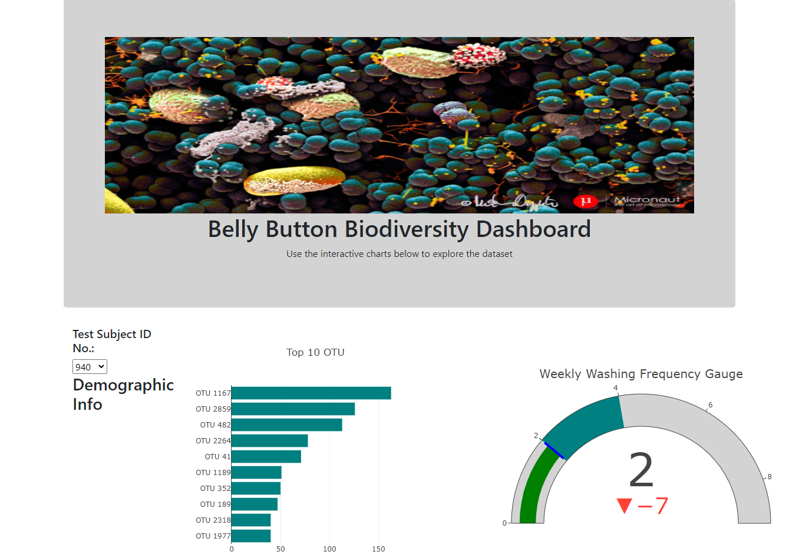
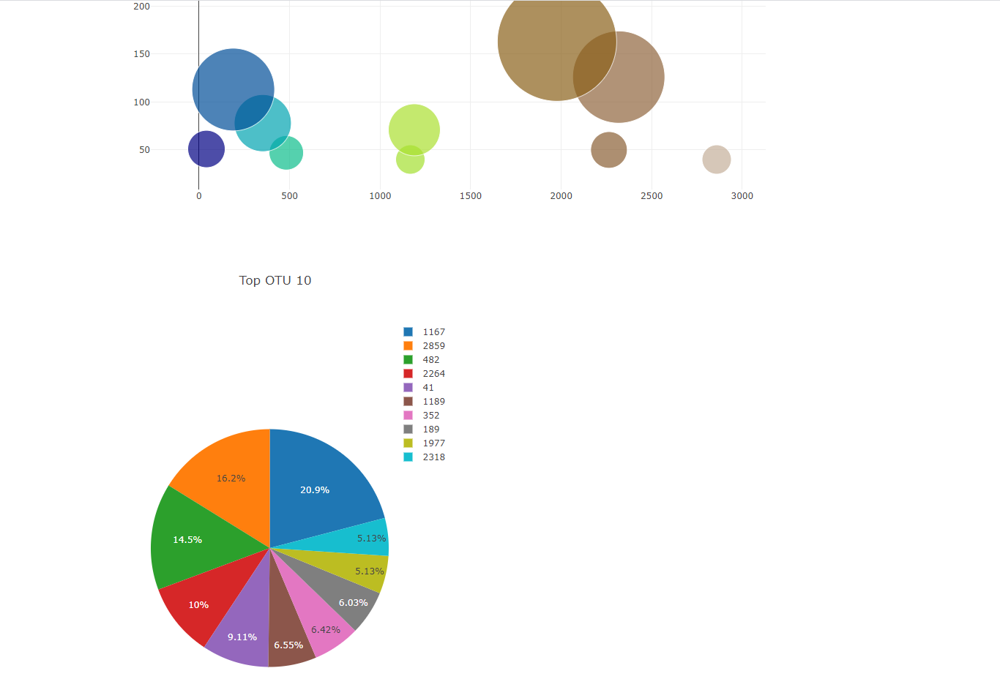

## Belly Button Biodiversity Dashboard Analysis
An interactive dashboard was used to explore the Belly Button Biodiversity dataset which cataloged the microbes that colonize human navels. 

Select a sample ID number from the dropdown menu to see the visualizations of that sample belly-button bacteria.

The Belly Button Analysis dashboard is at https://sj429.github.io/DemograhicDataWithPlotly/

## Languages and Technologies

JavaScript, Plotly.js, Python, HTML, CSS, Bootstrap, and Flask were the languages and technologies used to build the Belly Button Biodiversity dashboard. 

After the data was analyzed, the graphs were built using Plotly and JavaScript. The pie chart shows the top ten samples for a particular sample id.  

The bubble chart shows all the samples and OTU ID data points. Metadata for the sample is also displayed, along with a gauge chart for weekly washing frequency. 
